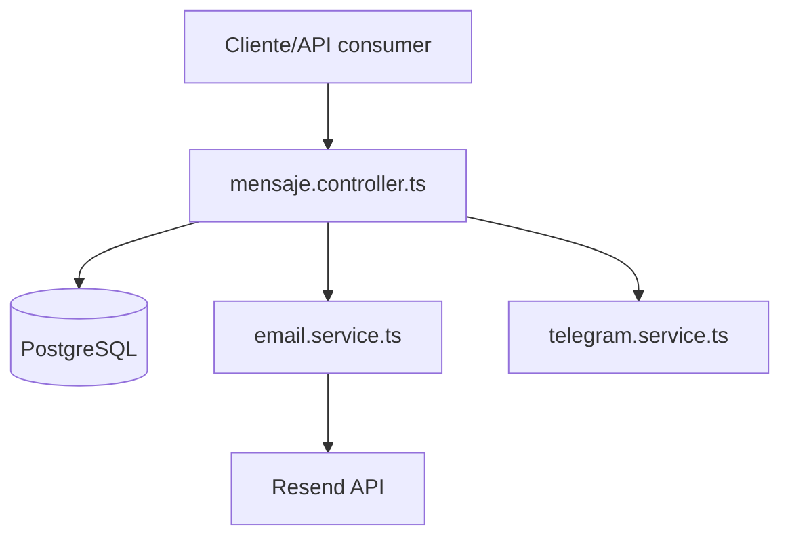
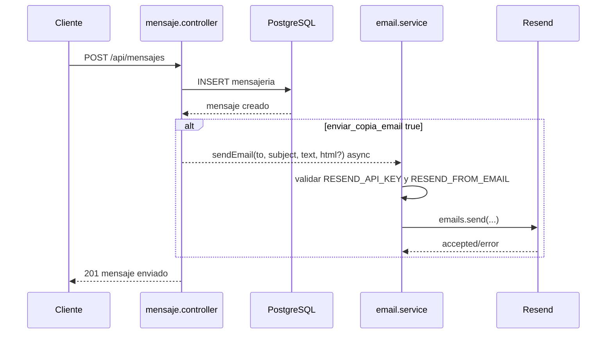

# Design: Integrar Resend como proveedor de correo

## Resumen
Se reemplazara Nodemailer por Resend manteniendo estable el contrato interno `sendEmail(to, subject, text, html?)`. El controlador de mensajes no debe conocer detalles del proveedor de correo; solo debe seguir invocando el servicio de email cuando `enviar_copia_email` sea `true` o `'true'`.

La migracion sera incremental y acotada: cambiar la implementacion del servicio de email, actualizar configuracion/documentacion, remover dependencias SMTP y validar con build/tests.

## Objetivos de diseno
- Mantener paridad funcional con el envio actual por Nodemailer.
- Reducir el acoplamiento del controlador al proveedor externo.
- Permitir remover `nodemailer` y `@types/nodemailer` sin romper TypeScript.
- Fallar de forma controlada cuando Resend no este configurado o el proveedor rechace el envio.
- No bloquear la creacion del mensaje interno por errores de correo.

## No objetivos
- No redisenar el modulo completo de mensajeria.
- No introducir colas, reintentos persistentes ni webhooks.
- No persistir IDs de envio de Resend.
- No cambiar contratos HTTP existentes.
- No modificar base de datos.

## Archivos probablemente modificados
- `src/services/email.service.ts`: reemplazar Nodemailer por Resend.
- `src/controllers/mensaje.controller.ts`: idealmente sin cambios; solo tocar si se detecta una necesidad menor para preservar la firma o mejorar logs sin cambiar contrato HTTP.
- `package.json`: remover `nodemailer` y `@types/nodemailer`; conservar `resend`.
- `package-lock.json`: actualizar lockfile acorde a `package.json`.
- `README.md`: reemplazar documentacion SMTP/Nodemailer por Resend.
- `.env.example` si existe o se crea en el futuro: documentar `RESEND_API_KEY` y `RESEND_FROM_EMAIL`.
- `src/tests/email.service.test.ts`: agregar pruebas unitarias del servicio de email si el tiempo de implementacion lo permite.

## Arquitectura propuesta

### Vista de componentes


### Responsabilidades
- `mensaje.controller.ts`: orquesta la creacion del mensaje, resuelve destinatarios y decide si corresponde solicitar copia por email.
- `email.service.ts`: encapsula configuracion, cliente Resend, formato minimo del payload y manejo de errores del proveedor.
- `README.md`: documenta variables actuales y elimina instrucciones SMTP obsoletas.
- `package.json`/`package-lock.json`: reflejan dependencias reales del runtime.

## Diseno detallado

### Servicio de email
Mantener la firma exportada:

```ts
sendEmail(to: string, subject: string, text: string, html?: string): Promise<boolean>
```

Comportamiento esperado:
- Leer `RESEND_API_KEY` desde `process.env`.
- Leer remitente desde `RESEND_FROM_EMAIL`.
- Si falta cualquiera de esas variables, registrar un error claro sin secretos y retornar `false`.
- Instanciar `Resend` con la API key.
- Invocar `resend.emails.send` con `from`, `to`, `subject`, `text` y `html` solo cuando exista.
- Si Resend retorna error o lanza excepcion, capturarla, registrar contexto no sensible y retornar `false`.
- Si Resend acepta el envio, retornar `true`.

### Configuracion
Variables vigentes:
- `RESEND_API_KEY`: API key del proveedor Resend.
- `RESEND_FROM_EMAIL`: direccion remitente validada en Resend, por ejemplo `Libro de Clases <notificaciones@dominio-verificado.cl>` o una direccion compatible con el dominio verificado.

Variables SMTP obsoletas que deben dejar de documentarse como requeridas:
- `EMAIL_HOST`
- `EMAIL_PORT`
- `EMAIL_SECURE`
- `EMAIL_USER`
- `EMAIL_PASS`

### Flujo de datos
1. Cliente llama `POST /api/mensajes` con datos del mensaje.
2. `mensaje.controller.ts` resuelve destinatarios individuales o por grupo.
3. Por cada destinatario se inserta el mensaje interno en PostgreSQL.
4. Si `enviar_copia_email` es `true` o `'true'`, el controlador invoca `sendEmail(...)` sin esperar para responder al cliente.
5. `email.service.ts` valida configuracion minima y envia por Resend.
6. Si Resend falla, el error se registra y el mensaje interno ya persistido se conserva.



## Manejo de errores
- Error por variables faltantes: `sendEmail` retorna `false`; log: `Email configuration missing: RESEND_API_KEY or RESEND_FROM_EMAIL` sin valores.
- Error del SDK/API: `sendEmail` retorna `false`; log con mensaje resumido y destinatario/asunto, sin API key.
- Error parcial en envio masivo: cada llamada a `sendEmail` se maneja de forma independiente; no debe cortar el loop de destinatarios.
- Error en persistencia del mensaje: sigue siendo responsabilidad actual del controlador y retorna error HTTP como hoy.

## Seguridad
- No hardcodear API keys ni remitentes.
- No imprimir `RESEND_API_KEY` ni headers de autorizacion.
- Evitar logs con cuerpos completos si pueden contener informacion sensible de estudiantes, apoderados o docentes.
- Mantener el cuerpo sanitizado en texto plano mediante `cleanHtml` como ocurre actualmente.

## Observabilidad
- Registrar envio exitoso con identificador devuelto por Resend si esta disponible, sin hacerlo parte del contrato publico.
- Registrar errores con contexto minimo: destinatario, asunto y tipo de fallo.
- No introducir logger nuevo si el proyecto aun usa `console`; mantener consistencia y dejar una mejora futura para logging estructurado.

## Dependencias
- Conservar `resend` como dependencia runtime.
- Remover `nodemailer` de `dependencies`.
- Remover `@types/nodemailer` de `devDependencies`.
- Actualizar `package-lock.json` usando el gestor del proyecto para evitar inconsistencias.
- No instalar dependencias nuevas sin aprobacion explicita, acorde a `.agents/AGENTS.md`.

## Estrategia de testing

### Tests unitarios recomendados
Crear `src/tests/email.service.test.ts` con Vitest y mocks de `resend`.

Casos minimos:
- Retorna `false` si falta `RESEND_API_KEY`.
- Retorna `false` si falta `RESEND_FROM_EMAIL`.
- Llama `resend.emails.send` con `from`, `to`, `subject`, `text` y `html` cuando todo esta configurado.
- Retorna `true` cuando Resend acepta el envio.
- Retorna `false` cuando Resend lanza excepcion o retorna error.

### Tests de integracion opcionales
Si se decide cubrir controlador:
- Mockear `sendEmail` y validar que se invoca cuando `enviar_copia_email` es `true` o `'true'`.
- Validar que no se invoca cuando el flag es `false` o viene ausente.

### Validaciones manuales/CI
- `npm run build`
- `npm test`
- `rg -n "nodemailer|createTransport|sendMail|EMAIL_HOST|EMAIL_PORT|EMAIL_SECURE|EMAIL_USER|EMAIL_PASS" src README.md package.json package-lock.json`

## Plan de migracion
1. Cambiar `email.service.ts` para usar Resend preservando `sendEmail`.
2. Agregar o ajustar tests del servicio de email.
3. Actualizar README y variables de entorno documentadas.
4. Remover Nodemailer de `package.json` y `package-lock.json`.
5. Ejecutar build/tests y busqueda de referencias obsoletas.

## Riesgos y mitigaciones
- Remitente no verificado en Resend: documentar `RESEND_FROM_EMAIL` como direccion verificada y tratar rechazo como error controlado.
- SDK de Resend con tipos distintos a lo esperado: validar contra TypeScript con `npm run build`.
- Falta de tests existentes para email: agregar tests unitarios con mock del SDK antes o junto con el cambio.
- Lockfile inconsistente al remover dependencias: usar `npm uninstall nodemailer @types/nodemailer` o una operacion equivalente autorizada.

## Criterios de revision del diseno
- El controlador sigue desacoplado del proveedor Resend.
- La firma `sendEmail` sigue compatible con el codigo existente.
- El fallo de email no rompe la creacion de mensajes.
- No quedan dependencias ni referencias runtime a Nodemailer.
- La documentacion refleja Resend como proveedor vigente.
